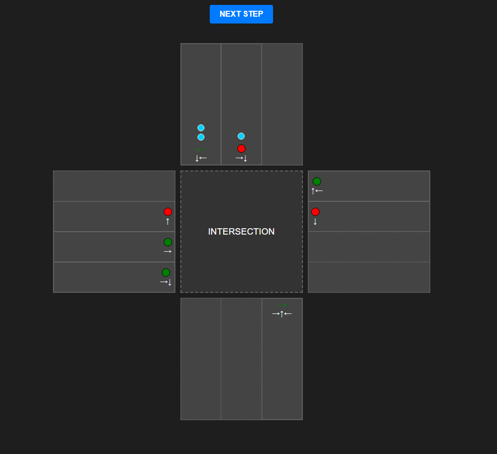

# Traffic Intersection Simulation

A traffic intersection simulation system. The application models vehicle behavior, traffic lights, and right-of-way rules based on light cycles. The project consists of a backend in Java and a frontend in React.

## Environment Requirements

- Java 17 (or newer)
- Maven
- Node.js (v18 or newer) and npm package manager

## Project Structure

- `frontend/` - User interface (React, TypeScript, Vite).
- `traffic-app/` - Simulation engine and business logic (Java, Maven).
  - `src/main/java/pl/trafficapp/domain` - Data models (Road, Lane, Intersection, Vehicle, TrafficLight).
  - `src/main/java/pl/trafficapp/managers` - Business logic (TrafficManager, TrafficLightManager, SimulationEngine).
  - `src/test/java` - Unit tests (JUnit 5, Mockito).

## Running the Application

### 1. Backend

Navigate to the `traffic-app` directory. First, build the project using Maven, then run the generated JAR file:

```bash
cd traffic-app

# Build the project
mvn clean package

# Run the simulation (you might need to replace 'traffic-app-1.0-SNAPSHOT-jar-with-dependencies.jar' with your actual generated jar name in the target folder)
# You can change commands.json and result.json for your own files
java -jar target/traffic-app-1.0-SNAPSHOT-jar-with-dependencies.jar commands.json result.json
```

### 2. Frontend

Navigate to the frontend directory, install dependencies, and start the development server:

```bash
cd frontend
npm install
npm run dev
```

The client application will be available at the address provided in the console (default is `http://localhost:5173`).

## User Interface (Frontend)

The frontend shows a real-time representation of the simulation state, letting you monitor the traffic flow and light changes easily.

- **Intersection Grid**: A top-down view of the 4-way intersection, showing all roads and lanes.
- **Vehicles**: Represented by **blue circles** that appear in lanes and move through the intersection.
- **Traffic Lights**: Circles (or arrows) showing the current state for each lane (**Red**, **Green**, or **Yellow**).
- **Directional Arrows**: Small white arrows on each lane indicating allowed directions (Straight, Left, Right).
- **Control**:
  - **"NEXT STEP"** button at the top allows you to trigger the next command from the loaded **.json** file.
  - Each click executes the next command from the queue (adding a new vehicle or performing a simulation tick), making analyzing the algorithm's decision-making process step-by-step possible.



## Traffic Control Algorithm Description

The logic for managing traffic lights and vehicle flow is designed to maximize throughput, maintain safety rules, and eliminate "starvation" (where vehicles on a less busy road wait forever).

### 1. Traffic Light Phase Selection (Wait Ticks)

The intersection operates on 4 directional groups: `NS_LEFT` (for collision-free left turns), `EW_LEFT`, `NS` and `EW`. Phase selection is dynamic:

- **Wait Ticks Prioritization:** In each cycle, lanes with a red light accumulate "priority points" equal to the number of waiting vehicles for their group.
- **Phase Switching:** The system selects the phase corresponding to the group with the highest sum of accumulated points (without repeating the last phase). A single vehicle waiting long enough will eventually accumulate more points than a newly arrived larger group of vehicles on another lane, guaranteeing its passage.
- **Fallback:** If there are no vehicles at the intersection, the algorithm iterates through the available phases sequentially.

### 2. Dynamic Green Light Duration

The duration of the green light is not hardcoded but calculated based on the current load of the selected phase:

- **Base calculation:** `number_of_vehicles / 2`
- **Time limits:** It has to be between `MIN_GREEN_LENGTH` (2 ticks) and `MAX_GREEN_LENGTH` (10 ticks).

### 3. Traffic Light State Machine

Transitions between phases include intermediate states for safety and intersection clearance:
`GREEN` -> `YELLOW` (1 tick) -> `RED_ALL` (1 tick) -> `RED_YELLOW` (Preparation, 1 tick) -> `GREEN`.

### 4. Right-of-Way Rules (TrafficManager)

The decision to leave the intersection is based on the vehicle's intent and the current state of the surroundings:

- **Going Straight:** Requires a full green light.
- **Right Turn:** Unconditional on full green. On a conditional green arrow (`GREEN_ARROW_RIGHT`), it requires a full stop first, then verifies there are no collisions with vehicles going straight from the left side.
- **Left Turn:** Unconditional on a collision-free left arrow (`GREEN_ARROW_LEFT`). On a full green light, it requires waiting for oncoming traffic to pass (going straight or turning right).

## Testing

The project includes a comprehensive suite of unit tests written using **JUnit 5** and **Mockito**. The tests cover domain models, state machine transitions, priority logic, and intersection rules.

To run the tests, navigate to the `traffic-app` directory and execute:

```bash
mvn test
```

## Input and Output

The backend engine processes a JSON input file containing a queue of commands (`addVehicle`, `step`). After executing the simulation, it generates a JSON output file containing the results (arrays of vehicle IDs that left the intersection in each step).
